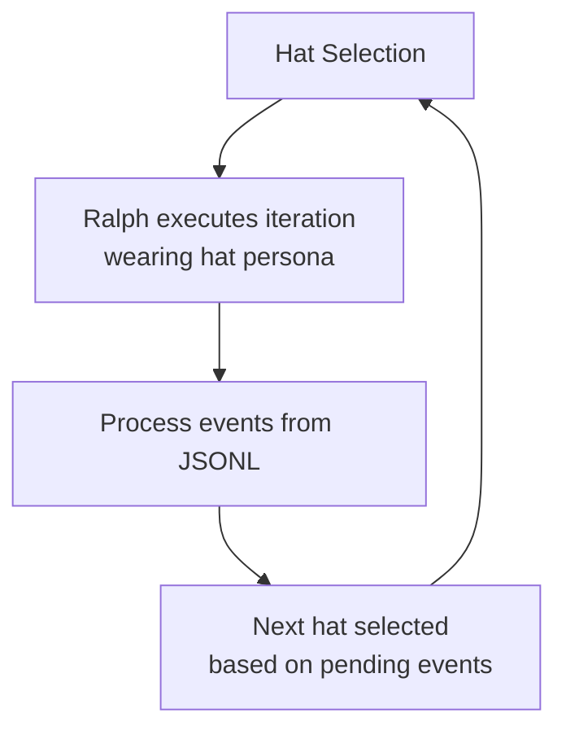
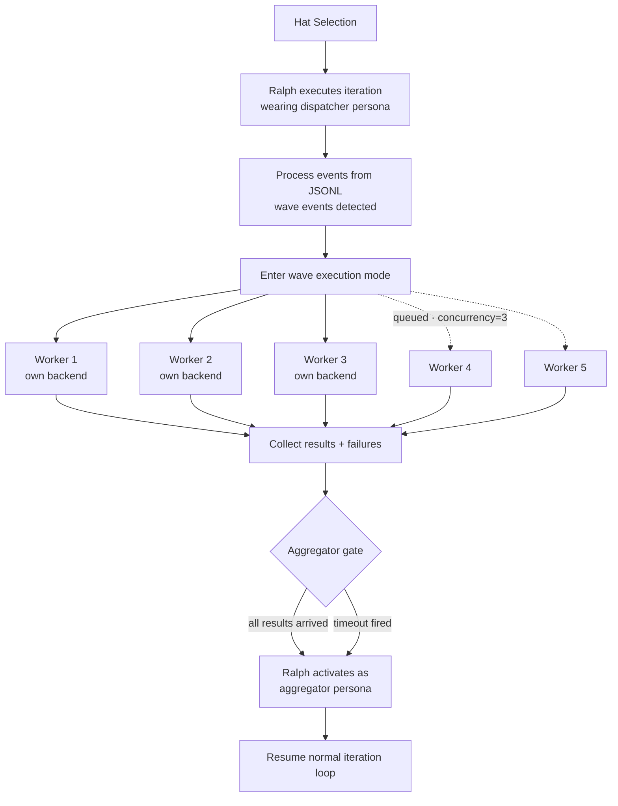
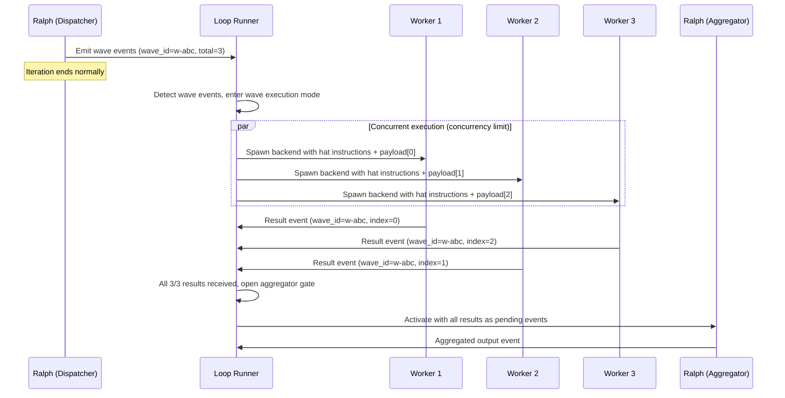
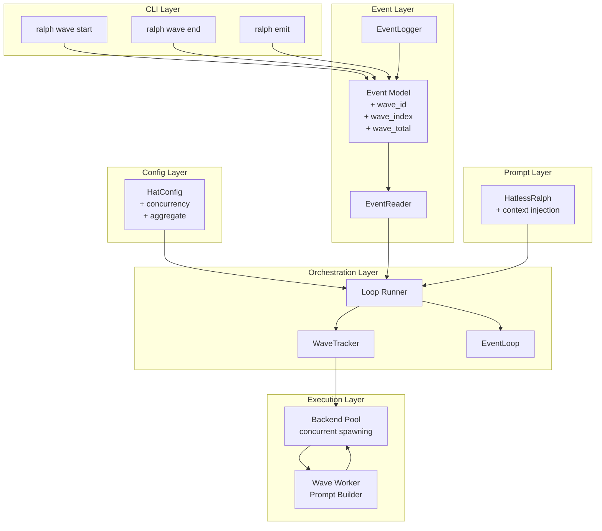

# Agent Waves: Design Document

## Overview

Agent Waves introduce intra-loop parallelism to Ralph's orchestration loop. Today, Ralph executes one hat per iteration, sequentially. Waves allow a dispatcher hat to fan out work to multiple concurrent backend instances, collect results, and aggregate them — all within a single orchestration run.

This is a general-purpose parallel execution primitive. Use cases include deep research (parallel topic exploration), multi-perspective analysis, parallel code review, scatter-gather for any domain, and multi-agent debate patterns.

Waves are built on three primitives inspired by Enterprise Integration Patterns:
1. **Wave-aware event emission** — events tagged with correlation metadata
2. **Concurrent hat execution** — the loop runner spawns multiple backends in parallel
3. **Aggregator gate** — a hat that buffers results and activates only when all correlated results arrive

Source: https://github.com/mikeyobrien/ralph-orchestrator/issues/210

---

## Detailed Requirements

### Core Architecture (from requirements clarification)

| Decision | Choice | Rationale |
|----------|--------|-----------|
| Execution model | Ralph dispatches, loop runner executes (Q1:B) | Preserves Hatless Ralph — Ralph decides WHAT to parallelize, loop runner handles HOW |
| Instance capability | Full hat execution, no nested waves (Q2:A) | Agents are smart; let them do the work. Guardrails are structural, not capability-based |
| Aggregation | Ralph as aggregator with `wait_for_all` gate (Q3:A) | Aggregator is just another hat. Only new thing is the gate |
| Dispatch mechanism | CLI tools + context injection for NL dispatch (Q4:C) | Same mechanism — CLI tools are the plumbing, context injection enables adaptive dispatch |
| Isolation | Shared workspace only (Q5:A) | Zero overhead, sufficient for read-heavy/write-disjoint workloads |
| Failure handling | Best-effort, hardcoded (Q6:B) | Wave continues on failure. Aggregator gets partial results + failure metadata |
| Cost accounting | Each instance = one activation (Q7:A) | Transparent. Existing limits (`max_activations`, `max_cost`) constrain wave size naturally |
| Aggregation timeout | 300s default, overridable (Q8:B) | Prevents hung waves. Aggregator fires with partial results on timeout |

### v1 Scope

**Included:**
- Wave CLI tools (`ralph wave start/emit/end`)
- Event correlation metadata (`wave_id`, `wave_index`, `wave_total`)
- Concurrent backend spawning in loop runner (respecting `concurrency` limit)
- `aggregate.mode: wait_for_all` with configurable timeout (default 300s)
- Context injection (downstream hat descriptions in prompt for NL dispatch)
- Best-effort failure handling with structured failure metadata
- Per-instance activation and cost accounting
- Shared workspace (no isolation)
- No nested waves

**Deferred to v2+:**
- Worktree isolation (`isolation: worktree`)
- Nested waves
- Additional aggregation modes (`first_n`, `quorum`, `external_event`)
- Configurable failure modes (`on_failure: fail_fast`)
- Wave-level cost limits
- Dedicated aggregator backends
- Multi-round debate optimizations

---

## Architecture Overview

### Normal Iteration



### Wave Iteration



### Wave Lifecycle



### Component Interaction



---

## Components and Interfaces

### 1. Event Model Extensions

**File:** `crates/ralph-proto/src/event.rs`

Add optional wave metadata to the `Event` struct:

```rust
pub struct Event {
    pub topic: Topic,
    pub payload: String,
    pub source: Option<HatId>,
    pub target: Option<HatId>,
    // New wave fields
    pub wave_id: Option<String>,
    pub wave_index: Option<u32>,
    pub wave_total: Option<u32>,
}
```

Builder methods:
```rust
impl Event {
    pub fn with_wave(mut self, wave_id: String, index: u32, total: u32) -> Self {
        self.wave_id = Some(wave_id);
        self.wave_index = Some(index);
        self.wave_total = Some(total);
        self
    }

    pub fn is_wave_event(&self) -> bool {
        self.wave_id.is_some()
    }
}
```

**File:** `crates/ralph-core/src/event_logger.rs`

Extend `EventRecord` with optional wave fields:

```rust
pub struct EventRecord {
    // ... existing fields ...
    #[serde(skip_serializing_if = "Option::is_none")]
    pub wave_id: Option<String>,
    #[serde(skip_serializing_if = "Option::is_none")]
    pub wave_index: Option<u32>,
    #[serde(skip_serializing_if = "Option::is_none")]
    pub wave_total: Option<u32>,
}
```

**File:** `crates/ralph-core/src/event_reader.rs`

Update the JSONL deserializer to parse wave fields. Use `#[serde(default)]` so existing events without wave fields parse correctly.

### 2. HatConfig Extensions

**File:** `crates/ralph-core/src/config.rs`

```rust
pub struct HatConfig {
    // ... existing fields ...
    /// Maximum concurrent instances when processing wave events.
    /// Default: 1 (sequential, current behavior).
    #[serde(default = "default_concurrency")]
    pub concurrency: u32,
    /// Aggregation configuration. When set, this hat buffers incoming
    /// wave-correlated events and only activates once all results arrive.
    #[serde(default)]
    pub aggregate: Option<AggregateConfig>,
}

fn default_concurrency() -> u32 { 1 }

#[derive(Debug, Clone, Serialize, Deserialize)]
pub struct AggregateConfig {
    /// Aggregation mode. v1 only supports `wait_for_all`.
    pub mode: AggregateMode,
    /// Timeout in seconds. Aggregator activates with partial results
    /// if not all wave results arrive within this duration.
    /// Default: 300 seconds.
    #[serde(default = "default_aggregate_timeout")]
    pub timeout: u32,
}

fn default_aggregate_timeout() -> u32 { 300 }

#[derive(Debug, Clone, Serialize, Deserialize)]
#[serde(rename_all = "snake_case")]
pub enum AggregateMode {
    WaitForAll,
}
```

**Validation** (in `RalphConfig::validate()`):
- `concurrency` must be >= 1
- If `aggregate` is set, `mode` must be `wait_for_all`
- Warn if `concurrency` > 1 but no downstream hat has `aggregate` configured (likely misconfiguration)
- Error if `aggregate` is set on a hat that also has `concurrency` > 1 (an aggregator shouldn't be a concurrent worker)

### 3. WaveTracker

**New file:** `crates/ralph-core/src/wave_tracker.rs`

Central state machine for tracking active waves.

```rust
pub struct WaveTracker {
    active_waves: HashMap<String, WaveState>,
}

pub struct WaveState {
    pub wave_id: String,
    pub expected_total: u32,
    pub source_hat: HatId,           // dispatcher hat
    pub worker_hat: HatId,           // hat that processes wave events
    pub result_topic: Option<Topic>, // topic workers publish to
    pub dispatched: Vec<WaveInstance>,
    pub results: Vec<WaveResult>,
    pub failures: Vec<WaveFailure>,
    pub started_at: Instant,
    pub timeout: Duration,
}

pub struct WaveInstance {
    pub index: u32,
    pub event: Event,              // the original wave event
    pub status: InstanceStatus,
}

pub enum InstanceStatus {
    Queued,
    Running,
    Completed,
    Failed(String),                // error message
    TimedOut,
}

pub struct WaveResult {
    pub index: u32,
    pub event: Event,              // the result event from worker
}

pub struct WaveFailure {
    pub index: u32,
    pub error: String,
    pub duration: Duration,
}

impl WaveTracker {
    pub fn new() -> Self;

    /// Register a new wave from detected wave events.
    pub fn register_wave(&mut self, wave_id: String, events: Vec<Event>,
                         worker_hat: HatId, timeout: Duration) -> &WaveState;

    /// Record a result event for a wave.
    pub fn record_result(&mut self, wave_id: &str, event: Event) -> WaveProgress;

    /// Record a failure for a wave instance.
    pub fn record_failure(&mut self, wave_id: &str, index: u32,
                          error: String, duration: Duration);

    /// Check if a wave is complete (all results or timeout).
    pub fn is_complete(&self, wave_id: &str) -> bool;

    /// Check for timed-out waves. Returns wave IDs that have timed out.
    pub fn check_timeouts(&mut self) -> Vec<String>;

    /// Get all results and failures for a completed wave.
    pub fn take_wave_results(&mut self, wave_id: &str) -> Option<CompletedWave>;

    /// Check if any wave is currently active.
    pub fn has_active_waves(&self) -> bool;
}

pub struct CompletedWave {
    pub wave_id: String,
    pub results: Vec<WaveResult>,
    pub failures: Vec<WaveFailure>,
    pub timed_out: bool,
    pub duration: Duration,
}

pub enum WaveProgress {
    /// More results expected.
    InProgress { received: u32, expected: u32 },
    /// All results received, wave complete.
    Complete,
}
```

### 4. Wave CLI Tools

**New file:** `crates/ralph-cli/src/wave.rs`

Top-level command (like `ralph emit`):

```rust
#[derive(Parser, Debug)]
pub struct WaveArgs {
    #[command(subcommand)]
    pub command: WaveCommands,
}

#[derive(Subcommand, Debug)]
pub enum WaveCommands {
    /// Start a new wave. Returns a wave ID.
    Start(WaveStartArgs),
    /// End the current wave. Finalizes expected count.
    End(WaveEndArgs),
    /// Batch emit: start wave, emit N events, end wave — all in one command.
    Emit(WaveBatchEmitArgs),
}

#[derive(Parser, Debug)]
pub struct WaveStartArgs {
    /// Expected number of wave events.
    #[arg(long)]
    pub expect: u32,
}

#[derive(Parser, Debug)]
pub struct WaveEndArgs {}

#[derive(Parser, Debug)]
pub struct WaveBatchEmitArgs {
    /// Event topic for all wave events.
    pub topic: String,
    /// Payloads for each wave event.
    #[arg(long, num_args = 1..)]
    pub payloads: Vec<String>,
}
```

**Wave state file:** `.ralph/wave-state.json`

During a wave emission sequence (`start` → multiple `emit` → `end`), the CLI tracks state in a temporary file:

```json
{
  "wave_id": "w-a3f7b2c1",
  "expected": 5,
  "emitted": 3,
  "started_at": "2026-02-28T10:00:00Z"
}
```

**`ralph wave start --expect N`:**
1. Generate wave ID (timestamp-based hex, matching existing `generate_prompt_id()` pattern)
2. Write wave state file
3. Print wave ID to stdout (agent captures it)

**`ralph emit` (during active wave):**
Enhanced to detect active wave state file. When present:
1. Read wave state, get `wave_id` and current `emitted` count
2. Tag the event with `wave_id`, `wave_index: emitted`, `wave_total: expected`
3. Increment `emitted` count in state file
4. Write event to JSONL as normal

When no wave state file exists, `ralph emit` works exactly as today (backwards compatible).

**`ralph wave end`:**
1. Validate `emitted == expected` (warn if mismatch, adjust `wave_total` on already-emitted events if needed)
2. Remove wave state file

**`ralph wave emit <topic> --payloads "a" "b" "c"`:**
Convenience command that does start + N emits + end atomically:
1. Generate wave ID
2. Write N events to JSONL, each with `wave_id`, `wave_index: 0..N-1`, `wave_total: N`
3. No state file needed (atomic operation)

### 5. Loop Runner Changes

**File:** `crates/ralph-cli/src/loop_runner.rs`

The main loop gains a new execution path after processing events from a normal iteration:

```
Main loop iteration:
  1. Hat selection → Ralph (dispatcher persona)
  2. Build prompt → include HATS table with downstream descriptions
  3. Execute backend → Ralph runs, emits wave events via CLI
  4. Process output
  5. Read events from JSONL
  6. *** NEW: Detect wave events ***
  7. If wave events detected:
     a. Enter wave execution mode
     b. Spawn concurrent backends (up to concurrency limit)
     c. Collect results (with timeout)
     d. Route results to EventBus
     e. Check aggregator gate
  8. Continue normal loop (aggregator activates next if gate open)
```

**Wave detection** (after `process_events_from_jsonl()`):
```rust
fn detect_wave_events(events: &[Event]) -> Option<DetectedWave> {
    // Group events by wave_id
    // Validate: all events in a wave_id have consistent wave_total
    // Return wave metadata + events
}
```

**Concurrent backend spawning:**
```rust
async fn execute_wave(
    &mut self,
    wave: DetectedWave,
    hat_config: &HatConfig,
    backend: &CliBackend,
) -> Result<Vec<WaveInstanceResult>> {
    let semaphore = Arc::new(Semaphore::new(hat_config.concurrency as usize));
    let mut handles = Vec::new();

    for instance in wave.events {
        let permit = semaphore.clone().acquire_owned().await?;
        let handle = tokio::spawn(async move {
            let result = execute_wave_instance(instance, hat_config, backend).await;
            drop(permit); // release concurrency slot
            result
        });
        handles.push(handle);
    }

    // Collect all results (with per-wave timeout)
    let timeout = Duration::from_secs(aggregate_timeout as u64);
    let results = tokio::time::timeout(timeout,
        futures::future::join_all(handles)
    ).await;

    // Handle timeout vs. completion
}
```

**Wave instance execution:**
Each wave instance gets:
- A fresh backend process (ACP or PTY, matching the hat's backend config)
- The worker hat's instructions as system context
- The specific wave event payload as the prompt/task
- Full tool access (same as normal hat execution)
- No Ralph coordination context (no HATS table, no scratchpad, no objective)

### 6. Wave Worker Prompt Builder

**New function in:** `crates/ralph-core/src/hatless_ralph.rs` or new file

Builds the prompt for a wave worker instance. Simpler than Ralph's full prompt:

```rust
pub fn build_wave_worker_prompt(
    hat_config: &HatConfig,
    event: &Event,
    wave_context: &WaveWorkerContext,
) -> String {
    // Sections:
    // 1. Hat instructions (from hat config)
    // 2. Wave context metadata (wave_id, index, total)
    // 3. Event payload (the specific work item)
    // 4. Event writing guide (how to emit result events)
    // 5. Nested wave guard ("Do NOT use `ralph wave` commands")
}
```

```rust
pub struct WaveWorkerContext {
    pub wave_id: String,
    pub wave_index: u32,
    pub wave_total: u32,
    pub result_topics: Vec<String>,   // from hat's `publishes`
    pub events_file: PathBuf,
}
```

### 7. Context Injection for NL Dispatch

**File:** `crates/ralph-core/src/hatless_ralph.rs`

Enhance the existing HATS table generation to include richer downstream context. When building the prompt for a hat that has `publishes` topics:

**Current behavior** (partially exists):
```
| Hat | Triggers On | Publishes | Description |
```

**Enhanced for waves:**
```
## Available Downstream Hats

When you emit events, they activate downstream hats. Use `ralph wave`
tools to fan out work in parallel.

| Topic | Activates | Description | Concurrent |
|-------|-----------|-------------|------------|
| review.security | Security Reviewer | Reviews for vulnerabilities, injection, auth bypass | up to 3 |
| review.perf | Perf Reviewer | Reviews hot paths, allocations, N+1 queries | up to 3 |
| review.maintain | Maintainability Reviewer | Reviews clarity, naming, duplication, coverage | up to 3 |

Emit multiple events as a wave to process them in parallel:
  ralph wave start --expect <N>
  ralph emit <topic> "<payload>"
  ... (repeat for each work item)
  ralph wave end
```

This context is injected only when:
- The active hat has `publishes` that target wave-capable hats (`concurrency > 1`)
- OR the active hat has `publishes` that target multiple different hats (scatter-gather pattern)

### 8. Aggregator Gate

**Integrated into:** `crates/ralph-core/src/event_loop/mod.rs`

The aggregator gate is a check in the event processing pipeline:

```rust
fn should_activate_hat(&self, hat_id: &HatId, pending_events: &[Event]) -> bool {
    let hat_config = self.registry.get_config(hat_id);

    match &hat_config.aggregate {
        Some(aggregate) => {
            match aggregate.mode {
                AggregateMode::WaitForAll => {
                    // Check if all correlated results have arrived
                    self.wave_tracker.is_wave_complete_for_hat(hat_id, pending_events)
                }
            }
        }
        None => {
            // No aggregation — activate normally (existing behavior)
            !pending_events.is_empty()
        }
    }
}
```

When the gate opens, all wave results are delivered to Ralph as pending events in a single prompt:

```
## PENDING EVENTS

Wave results (wave_id: w-abc123, 5/5 complete):

[0] review.result from Security Reviewer:
  Found SQL injection risk in src/db.rs:42...

[1] review.result from Perf Reviewer:
  N+1 query detected in src/api/users.rs:18...

[2] review.result from Maintainability Reviewer:
  Function `process_all` exceeds 200 lines...

[3] review.result (FAILED - instance timeout after 300s)

[4] review.result from API Reviewer:
  Breaking change: removed `user_id` field from response...
```

### 9. Nested Wave Prevention

Wave worker instances must not emit further waves. Enforced at two levels:

**Soft enforcement (prompt):** Wave worker prompts include:
```
IMPORTANT: Do NOT use `ralph wave start`, `ralph wave end`, or
`ralph wave emit` commands. You are a wave worker instance —
nested waves are not supported.
```

**Hard enforcement (CLI):** `ralph wave start` checks for an environment variable set by the loop runner for wave workers:
```rust
if std::env::var("RALPH_WAVE_WORKER").is_ok() {
    eprintln!("Error: nested waves are not supported. This instance is already a wave worker.");
    std::process::exit(1);
}
```

---

## Data Models

### Wave Event (JSONL format)

Emitted by dispatcher:
```json
{
  "topic": "review.file",
  "payload": "src/main.rs",
  "ts": "2026-02-28T10:00:00Z",
  "wave_id": "w-a3f7b2c1",
  "wave_index": 0,
  "wave_total": 5
}
```

Emitted by worker:
```json
{
  "topic": "review.result",
  "payload": "Found SQL injection risk in...",
  "ts": "2026-02-28T10:01:23Z",
  "wave_id": "w-a3f7b2c1",
  "wave_index": 0
}
```

### Wave State File (`.ralph/wave-state.json`)

Transient file during wave emission:
```json
{
  "wave_id": "w-a3f7b2c1",
  "expected": 5,
  "emitted": 3,
  "started_at": "2026-02-28T10:00:00Z"
}
```

### Hat Config (YAML)

```yaml
hats:
  dispatcher:
    name: "Research Dispatcher"
    description: "Identifies research topics and fans out parallel investigation"
    triggers: ["research.start"]
    publishes: ["research.topic"]
    instructions: |
      Analyze the research question and identify distinct topics
      to investigate in parallel. Fan out to researchers.

  researcher:
    name: "Deep Researcher"
    description: "Investigates a specific topic using web search and code analysis"
    triggers: ["research.topic"]
    publishes: ["research.finding"]
    concurrency: 5
    instructions: |
      You are researching a specific topic. Use all available tools
      to gather comprehensive information. Emit research.finding
      with your analysis.

  synthesizer:
    name: "Research Synthesizer"
    description: "Combines parallel research findings into a coherent report"
    triggers: ["research.finding"]
    publishes: ["research.complete"]
    aggregate:
      mode: wait_for_all
      timeout: 600
    instructions: |
      You have received findings from parallel research agents.
      Synthesize into a coherent report, noting areas of agreement,
      contradiction, and gaps.
```

### Completed Wave (internal)

```rust
pub struct CompletedWave {
    pub wave_id: String,
    pub results: Vec<WaveResult>,      // successful results
    pub failures: Vec<WaveFailure>,    // failed/timed-out instances
    pub timed_out: bool,               // did the aggregate timeout fire?
    pub duration: Duration,            // total wall-clock time
    pub total_cost: f64,               // accumulated API cost
    pub total_tokens: u64,             // accumulated token usage
}
```

---

## Error Handling

### Instance Failures (Best-Effort)

When a wave instance fails:
1. The failure is recorded in `WaveTracker` with error message and duration
2. The wave continues — other instances are unaffected
3. When the aggregator activates, failures appear as structured metadata in the prompt
4. The aggregator's instructions determine how to handle partial results

Failure types:
- **Backend error** — API returned an error (rate limit, server error)
- **Timeout** — instance exceeded its execution timeout (per-backend timeout, not wave timeout)
- **Crash** — backend process exited unexpectedly
- **Scope violation** — instance emitted an event outside its `publishes` whitelist

### Aggregation Timeout

When `aggregate.timeout` fires:
1. All running instances are cancelled (SIGTERM, then SIGKILL after 250ms)
2. Aggregator activates with all results received so far
3. Missing instances appear as `status: timeout` in the failure metadata
4. A `wave.timeout` event is published for diagnostics

### Nested Wave Attempt

Hard-blocked via `RALPH_WAVE_WORKER` env var check. CLI exits with error, no event emitted. The wave instance's iteration counts as a failure.

### Invalid Wave Configuration

Caught at config validation time:
- `concurrency: 0` → error
- `aggregate` on a hat with `concurrency > 1` → error (aggregator shouldn't be a concurrent worker)
- `aggregate.timeout: 0` → error

### Malformed Wave Events

If wave events have inconsistent metadata (e.g., different `wave_total` values for the same `wave_id`):
- Log warning to diagnostics
- Use the maximum `wave_total` seen
- Continue processing (don't fail the wave)

### Wave with Zero Results

If all instances fail or timeout:
- Aggregator still activates with empty results + all failures
- Aggregator can decide to retry, report failure, or take alternative action

---

## Acceptance Criteria

### Wave Dispatch

```
Given a hat collection with a dispatcher, worker (concurrency: 3), and aggregator
When the dispatcher emits 5 wave events using `ralph wave start --expect 5` / `ralph emit` / `ralph wave end`
Then the loop runner spawns worker backends with max 3 concurrent
And each worker receives the hat's full instructions plus its specific event payload
And each worker has full tool access
And workers execute to completion, emitting result events
```

### Aggregation Gate

```
Given an aggregator hat with `aggregate: { mode: wait_for_all, timeout: 300 }`
When 5 wave result events arrive with the same wave_id
Then the aggregator activates with all 5 results in a single prompt
And activation counts as 1 activation against the aggregator's max_activations
```

### Partial Results on Timeout

```
Given a wave with 5 expected results and aggregate timeout of 10s
When only 3 results arrive within 10 seconds
Then the aggregator activates with the 3 available results
And the prompt includes structured failure metadata for the 2 missing instances
And running instances are terminated
```

### Best-Effort Failure Handling

```
Given a wave with 5 instances where instance 3 fails with a backend error
When the remaining 4 instances complete successfully
Then the aggregator receives 4 results plus failure metadata for instance 3
And the failed instance counts as 1 activation against the worker hat
```

### Cost Accounting

```
Given a wave with 5 instances, each costing $0.10
When all instances complete
Then total cost reported is $0.50
And the worker hat's activation count increases by 5
And global cost tracking accumulates all instance costs
```

### NL Dispatch (Context Injection)

```
Given a dispatcher hat whose publishes target 3 different wave-capable hats
When Ralph builds the dispatcher's prompt
Then the prompt includes a "Available Downstream Hats" section
And each downstream hat's topic, name, description, and concurrency are listed
And wave emission instructions are included
```

### Nested Wave Prevention

```
Given a wave worker instance
When the worker attempts `ralph wave start`
Then the command fails with an error message
And the worker's iteration counts as a failure
```

### Backwards Compatibility

```
Given a hat collection with no concurrency or aggregate config
When the orchestration loop runs
Then behavior is identical to pre-wave Ralph (sequential, one hat per iteration)
And events without wave metadata are processed normally
```

### Batch Emission

```
Given an agent running `ralph wave emit research.topic --payloads "AI safety" "quantum computing" "climate modeling"`
When the command executes
Then 3 events are written to the events file
And each has the same wave_id with wave_index 0, 1, 2 and wave_total 3
And no wave state file is left behind
```

---

## Testing Strategy

### Unit Tests (ralph-core, ralph-proto)

- **Event model**: wave metadata serialization/deserialization, backwards compatibility with events missing wave fields
- **WaveTracker**: state machine transitions, timeout detection, result collection, failure recording
- **Config validation**: concurrency bounds, aggregate validation, invalid combinations
- **Aggregator gate**: `should_activate_hat()` with various wave completion states
- **Context injection**: downstream hat description generation, wave instruction formatting
- **EventReader**: parsing wave-annotated JSONL, mixed wave/non-wave events

### Integration Tests (ralph-core)

- **Wave lifecycle**: dispatcher emits → workers execute → aggregator collects (using mock backends)
- **Concurrency limiting**: N instances with concurrency M, verify max M concurrent
- **Timeout handling**: wave with slow instances, verify aggregator fires after timeout with partial results
- **Failure propagation**: instance failures recorded, aggregator receives failure metadata
- **Activation accounting**: verify per-instance counting against max_activations
- **Nested wave prevention**: worker attempts wave start, verify hard block

### Smoke Tests (replay-based)

- **End-to-end wave**: recorded JSONL fixture with wave dispatch → worker results → aggregation
- **Scatter-gather**: recorded fixture with multiple different worker hats
- **Partial failure**: recorded fixture with some workers failing

### E2E Tests (ralph-e2e)

- **Mock mode**: full wave lifecycle with mock backend
- **Live mode** (optional): actual API calls for a simple 2-3 instance wave

### CLI Tests

- **`ralph wave start`**: generates wave ID, creates state file
- **`ralph emit` with active wave**: tags events correctly
- **`ralph wave end`**: validates count, cleans up state file
- **`ralph wave emit`**: batch emission produces correct JSONL
- **Nested prevention**: `RALPH_WAVE_WORKER=1 ralph wave start` fails

---

## Appendices

### A. Technology Choices

| Choice | Rationale |
|--------|-----------|
| `tokio::sync::Semaphore` for concurrency | Already using tokio throughout; semaphore is the standard pattern for limiting concurrent async tasks |
| Timestamp-based wave IDs | Matches existing `generate_prompt_id()` pattern; avoids uuid dependency |
| File-based wave state (`.ralph/wave-state.json`) | Consistent with existing file-based coordination (events.jsonl, loop.lock) |
| Serde optional fields for wave metadata | Backwards compatible; existing events without wave fields parse correctly |

### B. Research Findings

Key findings from codebase research (full details in `research/` directory):

1. **Event system** is file-based (JSONL), not in-process. Events flow: agent CLI → file → EventReader → EventBus. Extension is clean — add optional fields with serde defaults.

2. **Loop runner** is strictly sequential with one backend per iteration. The bottleneck is `tokio::select!` in `loop_runner.rs:1214`. Wave execution inserts a new async phase between event processing and the next normal iteration.

3. **Hatless Ralph** is the constant coordinator — custom hats are personas, not independent executors. Wave workers are the **first case where hats execute directly** with their own backend process, outside Ralph's coordination. This is a deliberate, bounded exception to the model.

4. **HATS table** already resolves `publishes` → downstream hats with descriptions and Mermaid flowcharts. Context injection for NL dispatch extends this existing mechanism.

5. **Worktree infrastructure** exists and is reusable for future `isolation: worktree` but is intentionally deferred from v1.

### C. Alternative Approaches Considered

| Alternative | Why Rejected |
|-------------|-------------|
| Break Hatless Ralph model entirely (Q1:A) | Creates two execution paths, loses Ralph's coordination coherence |
| Loop-runner-only parallelism (Q1:C) | Kills NL-driven adaptive dispatch, the key differentiator from static config |
| Lightweight wave instances (Q2:B) | Violates "agents are smart, let them do the work" — prescribes capability limits |
| Dedicated aggregator backend (Q3:B) | Premature optimization — Ralph-as-aggregator handles common cases, dedicated backend is v2 |
| Worktree isolation in v1 (Q5:B) | Disproportionate complexity for primarily read-heavy v1 use cases |
| Fail-fast failure mode (Q6:A) | Partial results are almost always useful; one failure shouldn't waste the whole wave |
| Wave = one activation (Q7:B) | Hides real resource usage from users; breaks max_activations budget contract |

### D. Future Extensions (v2+)

- **Worktree isolation**: `isolation: worktree` for write-heavy waves, using existing `create_worktree()` infrastructure
- **Nested waves**: wave workers emitting sub-waves for hierarchical decomposition
- **Additional aggregation modes**: `first_n` (activate after N results), `quorum` (majority), `external_event` (wait for external signal)
- **Configurable failure modes**: `on_failure: fail_fast | best_effort`
- **Dedicated aggregator backends**: separate process for aggregation when result sets are large
- **Wave-level cost limits**: `max_wave_cost` to cap individual wave spend
- **Multi-round debate**: explicit config support for iterative scatter-gather patterns
- **Wave diagnostics dashboard**: real-time wave progress in TUI and web dashboard
